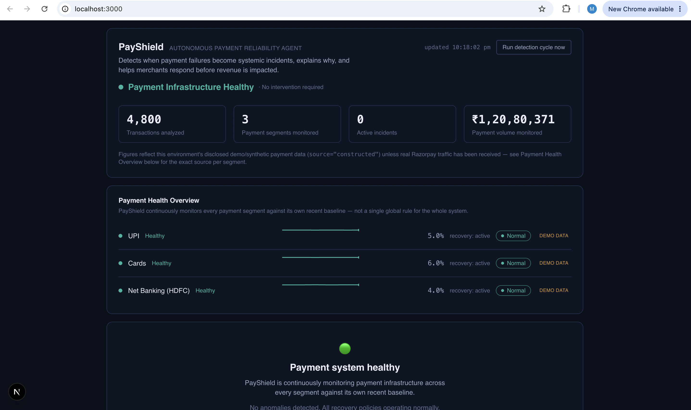
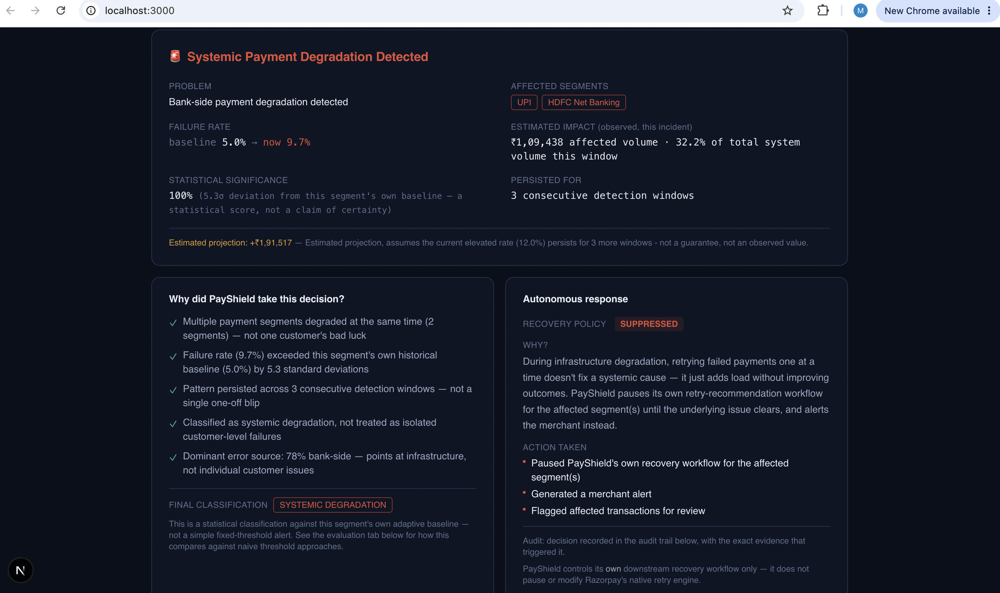
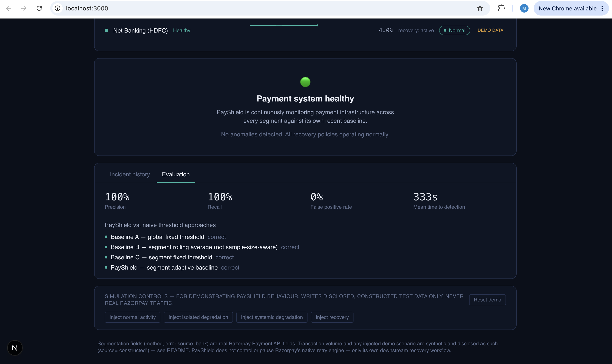

# PayShield

An autonomous payment reliability agent that detects systemic payment
degradation before it impacts merchant revenue.

Built for the Razorpay AI Buildathon (Track 3 — AI Revenue Recovery). See
[`PROJECT_BRIEF.md`](./PROJECT_BRIEF.md) for the original design rationale.



---

## Problem

When a payment fails, most merchants see it as one customer's bad luck —
a declined card, a flaky UPI app, whatever. Support tickets come in one at
a time, and they get handled one at a time.

But sometimes a bunch of failures aren't unrelated at all. A bank's
authorization service has a rough twenty minutes, and suddenly dozens of
UPI payments through that bank start failing — not because of anything
the customers did, but because of one shared, systemic cause. To a
merchant looking at a list of individual failed transactions, that looks
exactly like fifty separate problems. It isn't. It's one incident wearing
fifty different faces, and if nobody notices the pattern, nobody responds
to the actual cause — they just keep firing off retries into a
still-broken pipe.

## Solution

PayShield watches every payment segment (a method, plus a bank where one
applies — `upi`, `card`, `netbanking:HDFC`, and so on) against **its own
recent history**, not a single fixed rule applied to everything. When a
segment's failure rate moves far enough from its own normal baseline, and
stays there across more than one detection window, PayShield checks
whether other segments are moving the same way at the same time. One
segment alone, deviating on its own — that's an isolated problem. Multiple
segments moving together — that's systemic.

Once it's classified an incident, PayShield doesn't just raise a flag and
walk away. It explains *why* it reached that conclusion (baseline
deviation, how many segments, how long the pattern held, what fraction of
failures point at the bank vs. the customer), and it adjusts its own
downstream recovery workflow accordingly — suppressing retry
recommendations during a systemic incident (retrying into a broken
pipe doesn't help anyone), then restoring them automatically once the
data shows the segment is actually healthy again. Every step of that is
written to an audit trail, in plain language, not just a log line.

## Why this matters

A merchant dealing with a systemic payment issue is losing revenue for
every minute it goes unrecognized as one problem — every additional
retry against a still-broken bank is wasted effort, every minute spent
triaging fifty "unrelated" tickets is a minute not spent on the actual
fix (or the merchant's own communication with their bank/gateway). Seeing
the pattern early, and understanding *why* it's being called systemic
rather than just trusting a black box, is what turns "we noticed
something's wrong" into "we know what's wrong and we're already
responding to it." This is a narrow, honest claim: PayShield surfaces the
pattern and explains it — it doesn't fix the bank's outage, and it
doesn't claim a specific rupee amount was "saved."

## How it works

```
Razorpay Events (payment.failed / payment.captured)
        │
        ▼
Event Processing        — webhook signature verification, idempotent write
        │
        ▼
Segment Analysis         — bucket into canonical 5-minute windows per segment
        │
        ▼
Anomaly Detection        — EWMA baseline + sample-size-aware z-score per segment
        │
        ▼
Decision Engine          — isolated vs. systemic, deterministic 5-state machine
        │
        ▼
Recovery Policy          — suppress/restore PayShield's own downstream workflow
        │
        ▼
Audit Trail              — every transition, with reasoning, in plain language
```

## Architecture

```
Razorpay (test mode)
   │  payment.failed / payment.captured webhook (event-driven, real-time)
   ▼
FastAPI backend — webhook ingestion
   - HMAC signature verification
   - idempotent write (x-razorpay-event-id primary key, payment_id+outcome secondary)
   ▼
Supabase (Postgres via PostgREST) — single source of truth
   - events / segment_windows / agent_state / agent_state_history /
     recovery_policy / alerts
   ▲  (read on a schedule, not per-webhook)
GitHub Actions — every 5 minutes
   │  POST /api/cron/detect (secret-protected)
   ▼
FastAPI — the detection/decision cycle
   aggregator → detector → decision_engine → recovery_policy → alert_text → Supabase
   (an LLM is called in exactly one place, only to write the alert TEXT
   after a decision is already made — never to make the decision itself)
   ▲
Next.js dashboard
   reads via the backend's own API — never talks to Supabase directly
```

The frontend (Next.js/React/TypeScript) is a thin client: it has no
server-side routes or secrets of its own, and calls only the FastAPI
backend's own endpoints. The backend is the only thing that talks to
Supabase, Razorpay, and Groq.

## Key Features

- **Systemic vs. isolated classification** — not just "something's wrong,"
  but a real distinction between one segment's own problem and multiple
  segments degrading together.
- **Explainable decisions** — every classification comes with the actual
  checks PayShield ran (baseline deviation, segment correlation,
  persistence across windows, dominant error source), not a black-box
  score.
- **Bounded, reversible recovery workflow** — PayShield suppresses and
  restores its *own* downstream recovery actions based on the data; it
  never touches Razorpay's own retry engine or any financial transaction.
- **Webhook security** — HMAC-SHA256 signature verification,
  constant-time compare.
- **Idempotency** — Razorpay's own delivery ID is the primary dedup key,
  with a secondary safeguard; re-processing the same event, or re-running
  a detection cycle on unchanged data, is always a safe no-op.
- **Full audit trail** — every state transition is persisted with its
  reasoning, in language a non-engineer can read, not just a raw log.

## Tech Stack

**Frontend:** Next.js 16, React 19, TypeScript, Tailwind CSS 4

**Backend:** FastAPI (Python), Pydantic v2

**Database:** Supabase (Postgres via PostgREST)

**Intelligence engine:** NumPy + SciPy (`norm.cdf`) for the statistical
detector — deliberately not a black-box ML model; see
[Detector methodology](#detector-methodology) below for why.

**Other:** Razorpay webhooks (test mode), Groq (alert-text generation
only), GitHub Actions (scheduled detection cron)

## Demo Instructions

1. Open the dashboard.
2. View the healthy state — PayShield is monitoring every segment against
   its own baseline, nothing flagged.
3. Click **"Inject systemic degradation"** (bottom of the page — clearly
   labeled as writing disclosed, synthetic demo data).
4. Click **"Run detection cycle now"**.
5. Observe the incident card, the reasoning panel ("why did PayShield take
   this decision?"), and the autonomous response panel (recovery policy
   suppressed, with the reason).
6. Click **"Inject recovery"**, then **"Run detection cycle now"** again —
   the incident resolves back to healthy, and the recovery policy restores
   to active. **"Reset demo"** clears the simulation at any time.

Every one of these writes is disclosed, synthetic data (`source =
"constructed"` in the database) — never real Razorpay traffic, and always
visibly labeled as such in the UI.





## Security Considerations

- **Webhook signature verification** — every inbound Razorpay webhook is
  verified with HMAC-SHA256 (constant-time compare) before anything is
  written; an invalid signature is rejected outright.
- **Idempotency** — Razorpay's own per-delivery event ID is the primary
  dedup key (a duplicate delivery is detected via a unique-constraint
  violation and short-circuited, never reprocessed), with a secondary
  `(payment_id, outcome)` safeguard.
- **Secret management** — every real secret (Supabase's service-role key,
  Razorpay keys, the cron secret) lives only in the FastAPI backend's own
  environment. The frontend has no secrets of its own; its only required
  variable is the backend's URL.
- **Merchant isolation design** — every merchant-facing table carries a
  `merchant_id` column, and Row Level Security is enabled as an
  independent second layer: even a direct, non-backend query against
  Supabase's public API can only see rows for the merchant the querying
  user is actually mapped to. This ships off by default (a single demo
  merchant, no login screen) so today's demo never breaks, and turns on
  with two matching environment flags when you want it — see
  [Multi-tenancy & auth](#multi-tenancy--authentication) below.
- **Optional authentication** — Supabase Auth (email/password) can gate
  the dashboard behind a real login, verified server-side against a JWT.
  Off by default for demo reliability; see below for how to turn it on.

## Scalability

Today's shape — one FastAPI process, a 5-minute GitHub Actions cron, and
Supabase/Postgres — is the honest, right-sized architecture for a
hackathon submission and a genuinely small real merchant's traffic.
Webhook ingestion is a single indexed insert per event (cost doesn't grow
with history size), and the detection cycle only ever reads a bounded,
recent rolling window — never the full events table.

What a larger deployment would add, **documented here rather than built**
(building it now would be over-engineering for this submission):

```
Events
   ↓
Queue                — a job table or managed queue, so a burst of
   ↓                   webhooks never blocks on the detection cycle
Workers               — the detection cycle sharded by merchant,
   ↓                   run in parallel instead of one process looping
Detection Engine        every segment for every merchant serially
   ↓
Decision Layer
```

The one deliberate, known limitation worth naming honestly:
`agent_state`/`recovery_policy` are keyed by segment name alone, not
`(merchant_id, segment)`. With exactly one demo merchant today that's
inconsequential; it's the first thing to generalize before a second real
merchant is onboarded, and it's a low-risk, additive fix — not a
redesign.

## Future Improvements

- Composite-key multi-tenancy (`(merchant_id, segment)`) once a second
  real merchant is onboarded.
- Live verification of the exact Razorpay test-mode webhook payload shape
  against a real account (the field-parsing logic is defensive and
  documented, but hasn't been hand-confirmed against a live delivery).
- Queue-backed webhook ingestion and per-merchant parallel detection, once
  real traffic volume justifies the added complexity.
- A merchant-facing settings view for recovery-policy overrides, rather
  than the fully automatic suppress/restore behavior today.

---

## Detector methodology

An EWMA-adaptive per-segment baseline, plus a sample-size-aware z-score
significance test, plus a `scipy.stats.norm.cdf`-derived **statistical
significance score** (`backend/app/services/detector.py`).

- **Why "significance score," not "confidence":** it's a disclosed
  normal-CDF mapping of the sigma deviation — not a calibrated probability
  that the anomaly is real, and it's never presented as one.
- **Sample-size-awareness:** at least 20 events are required before a
  window can be flagged significant at all, regardless of how extreme the
  rate looks.
- **Baseline freezing during an ongoing incident:** the baseline only
  updates using windows that weren't themselves flagged significant. This
  guards against a real bug found via integration testing during the
  original build: a baseline that keeps updating on every prior window,
  including anomalous ones, drifts toward an ongoing incident and can
  eventually mark it "back to normal" purely because the baseline learned
  to treat the bad rate as normal. See `compute_clean_baselines` and
  `backend/tests/test_detector.py`'s
  `test_baseline_freeze_never_auto_resolves_a_constant_unrecovering_incident`.
- **Canonical windows:** epoch-aligned, fixed 5-minute buckets — not
  "now minus 5 minutes," so re-running detection on the same data is
  deterministic.
- **Empty windows:** treated as `NO DATA`, never a synthetic 0% failure
  rate.
- **Idempotency:** re-running detection on unchanged data always produces
  the same answer — proven end-to-end in `backend/tests/test_integration.py`.

Why not a black-box ML model here: the actual problem — "is this
segment's current rate unusual for its own history, and are multiple
segments moving together" — is well-served by a transparent, explainable
statistical test that a judge (or a merchant) can actually follow the
reasoning for. An opaque model would trade that explainability for
nothing this problem actually needs.

## Agent state machine

Five states, deterministic, persisted, idempotent
(`backend/app/services/decision_engine.py`):

```
NORMAL → MONITORING → (ISOLATED_DEGRADATION | SYSTEMIC_DEGRADATION)
                    → (RESOLVED → NORMAL) | ESCALATED
```

Every transition writes a row to `agent_state_history` with the previous
state, the reasoning, the actions taken, the full detector evidence, and
the canonical window as a correlation ID — this is the audit trail.

## Internal recovery policy

**PayShield does not control, pause, or modify Razorpay's native retry
engine — no such API exists, and this project never claims otherwise.**
What it controls is its own `recovery_policy` table (one row per
segment): `ACTIVE` under normal conditions, `SUPPRESSED` during a
degradation (so PayShield doesn't keep recommending retries into a
still-broken pipe), restored to `ACTIVE` once the data shows genuine,
sustained recovery. Observable end-to-end in the dashboard's Autonomous
Response panel and the audit trail.

## Multi-tenancy & authentication

Every merchant-facing table (`events`, `segment_windows`, `agent_state`,
`agent_state_history`, `recovery_policy`, `alerts`) carries a
`merchant_id` column, `DEFAULT`-valued to a single demo merchant
(`merchant_demo_001`) so every existing row and every write path that
doesn't mention it explicitly keeps working unchanged
(`supabase/migrations/002_multi_tenancy_and_rls.sql`). Row Level Security
is enabled on all of them as an independent second layer, on top of (not
instead of) the backend's own access control.

Supabase Auth (email/password) can gate the dashboard behind a real
login. It's controlled by two flags that must agree: `REQUIRE_AUTH`
(backend) and `NEXT_PUBLIC_REQUIRE_AUTH` (frontend) — **both default to
`false`**, so the dashboard behaves exactly as it always has, no login
screen, until you deliberately turn both on. The Razorpay webhook and the
GitHub Actions cron trigger are intentionally not gated by this (they
authenticate via HMAC signature and a shared secret respectively, and
have no logged-in-user concept) — a deliberate, documented scope
boundary, not an oversight.

Rate limiting is a lightweight, in-memory per-IP sliding window
(`backend/app/core/rate_limit.py`, default 120 requests/minute, no Redis
or external dependency) — sized to block obvious abuse of a public demo,
not to shape real production traffic.

## Real vs. synthetic data

Every row in `events` carries a `source` column (`"live"` or
`"constructed"`), never blurred. Demo-injected batches are never fed into
the evaluation harness's ground truth, and the evaluation harness's own
injected-anomaly data is never read by the live detector.

## Evaluation methodology

```bash
cd backend && source venv/bin/activate
python -m app.evaluation.benchmarks
```

17 controlled synthetic scenarios (magnitude sweep, duration sweep,
sample-size sweep, multiple no-anomaly control periods), scored against
three plainly-named naive baselines plus PayShield itself:

1. **Baseline A** — global fixed threshold (20%, the same number for every segment)
2. **Baseline B** — segment rolling average, fixed z-score, **not** sample-size-aware
3. **Baseline C** — segment fixed threshold (12%, not derived from history)
4. **PayShield** — segment-adaptive EWMA baseline + sample-size-aware z-score

A controlled synthetic evaluation, explicitly distinguished from
real-world validation — deterministic seeds via `numpy.random.default_rng`.

## Limitations

- Transaction volume in the demo/evaluation is synthetic, never claimed to
  mirror real-world bank behavior.
- UPI bank-identity segmentation is PayShield's own inference from the VPA
  suffix — always disclosed, never a detection axis.
- PayShield cannot control Razorpay's native retry engine or force a
  payment-method switch.
- The significance score is a disclosed heuristic, not a calibrated
  probability.
- The exact live webhook payload shape hasn't been hand-confirmed against
  a real Razorpay test-mode delivery in this pass.
- `agent_state`/`recovery_policy` are keyed by segment name alone, not
  `(merchant_id, segment)` — see [Scalability](#scalability) above.
- Running two services (a Node host + a Python host) instead of one means
  two sets of environment variables and CORS configuration, and — on a
  free-tier Python host — cold-start latency on the first request after
  an idle period. Reload once if the dashboard's first load looks empty
  right after a period of inactivity.

## ₹0 stack

| Service | Purpose | Free tier | Card required? |
|---|---|---|---|
| Vercel | Next.js dashboard hosting | Hobby tier | No |
| Render (or Fly/Railway) | FastAPI backend hosting | Free web service | No |
| Supabase | Event store, aggregation, agent state | 500MB DB free tier | No |
| GitHub Actions | Scheduled detection/decision cycle | Free minutes on public repos | No |
| Groq | Alert-text generation only, on transitions only | Free tier | No |
| Razorpay test mode | All payment/webhook data | Free by definition | No |

## Local setup

**Backend:**
```bash
cd backend
python3 -m venv venv && source venv/bin/activate
pip install -r requirements.txt
cp .env.example .env   # fill in Supabase/Razorpay/Groq/CRON_SECRET
python -m pytest -q                 # confirm every module still passes
python -m app.evaluation.benchmarks # run the evaluation battery
uvicorn app.main:app --reload --port 8000
```

**Frontend:**
```bash
npm install
cp .env.example .env.local   # NEXT_PUBLIC_API_BASE_URL=http://localhost:8000
npm run build                # confirm it builds clean
npm run dev
```

## Environment variables

**Backend** (`backend/.env.example`, server-only): `SUPABASE_URL`,
`SUPABASE_SERVICE_ROLE_KEY`, `RAZORPAY_KEY_ID`, `RAZORPAY_KEY_SECRET`,
`RAZORPAY_WEBHOOK_SECRET`, `GROQ_API_KEY` (optional), `CRON_SECRET`,
`ALLOWED_ORIGINS`, `REQUIRE_AUTH` (optional, default `false`),
`RATE_LIMIT_PER_MINUTE` (optional, default `120`).

**Frontend** (`.env.example`): `NEXT_PUBLIC_API_BASE_URL` — the backend's
URL, not a secret. Optionally `NEXT_PUBLIC_SUPABASE_URL` +
`NEXT_PUBLIC_SUPABASE_ANON_KEY` + `NEXT_PUBLIC_REQUIRE_AUTH` to enable the
login screen — leave all three blank/`false` to keep today's no-login
behavior. If you enable auth, `NEXT_PUBLIC_REQUIRE_AUTH` and the backend's
`REQUIRE_AUTH` must match, or you'll either get no gate at all or a
dashboard nobody can reach.

## Database setup

Run [`supabase/schema.sql`](./supabase/schema.sql) once, in full, against
a fresh Supabase project. Then run
[`supabase/migrations/002_multi_tenancy_and_rls.sql`](./supabase/migrations/002_multi_tenancy_and_rls.sql)
— adds `merchant_id` to every merchant-facing table (backfilled via a
`DEFAULT`, safe to run against a project that already has data) and
enables Row Level Security. Both files are idempotent — safe to re-run.

## Razorpay webhook setup

Point the webhook at your **deployed FastAPI backend's** URL:
`https://<your-backend-host>/api/webhooks/razorpay` (Razorpay rejects
localhost — deploy first). Subscribe to `payment.failed` and
`payment.captured`.

## Deployment instructions

1. **Backend:** push to GitHub, deploy `backend/` to Render (blueprint at
   `backend/render.yaml`) or any FastAPI-compatible free host. Set every
   env var from `backend/.env.example` in the host's dashboard.
2. **Frontend:** deploy the repo root to Vercel; set
   `NEXT_PUBLIC_API_BASE_URL` to the backend's deployed URL.
3. **GitHub Actions:** set repo secrets `PAYSHIELD_API_URL` (the backend's
   URL) and `CRON_SECRET` (matching the backend's value).
4. Register the Razorpay webhook against the deployed backend URL (see
   above) — optional; the full demo flow works without it.

## What PayShield does NOT control

Razorpay's native retry engine, a customer's payment method choice, or
any financial transaction — and the LLM never decides whether or what
action fires; it only writes the alert text after a decision has already
been made deterministically.
